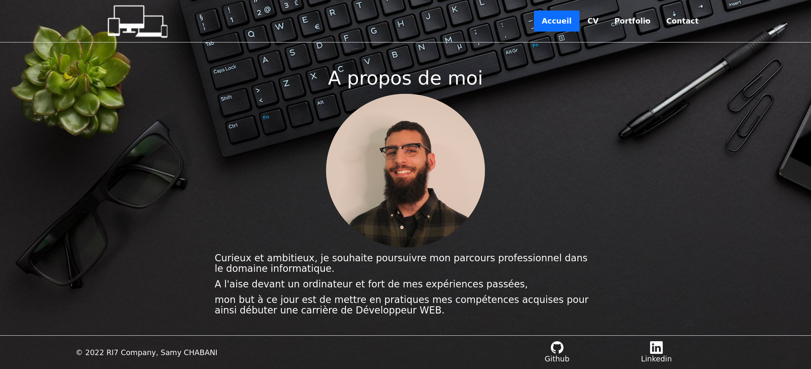

# Portfolio - My Personal Website

This project was created during my training. I developed it using Node.js, Express, and the Twig template engine. The site's purpose is to showcase my work, skills, and experience. It features a typewriter-style animation and presents my CV in a style inspired by Visual Studio Code. Additionally, I have temporarily disabled the email sending function.

## Features

- Portfolio highlighting my work and projects.
- Typewriter-style animation.
- My CV presented in a style inspired by Visual Studio Code.

## How to Run the Project

To run this project on your computer, follow these steps:

1. Clone the project repository to your local machine.

2. Run `npm install` to install the necessary dependencies.

3. Start the application with `npm start`.

4. Access the portfolio site via [http://localhost:8080](http://localhost:8080) in your web browser.

## Email Sending Disabled

I have temporarily disabled the email sending function in the project.

Explore my portfolio and learn more about my work and skills!

Feel free to ask any additional questions.
